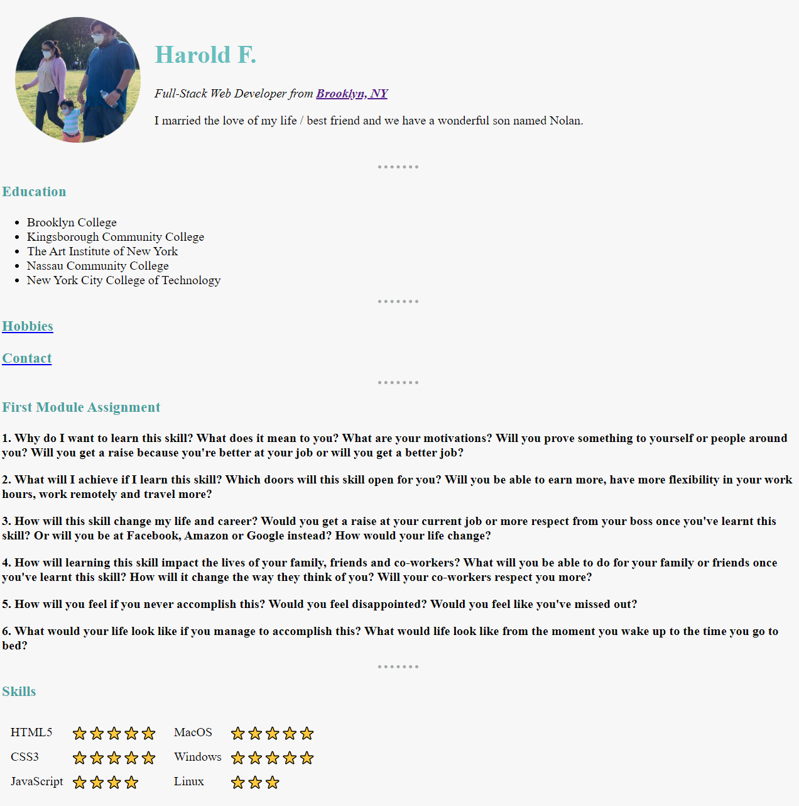

# personal-site
<!--  -->


> Assignment #1 in 2020 Full-Stack Web Development Bootcamp by Dr. Angela Yu
___

### Table of Contents

- [Description](#description)
- [Usage](#usage)
- [Credits](#credits)
___

## Description

This first assignment in the 2020 Fullstack Web Development Bootcamp was very easy to complete. It just made use of simple HTML and CSS to create a basic static website.

Using HTML to simply link to outside pages within our anchor tags. The professor also mentioned to never use tables to customize our style.

One problem that I ran into while completing this project was the hr tag. The task for the hr tag was to just make it look like a row of circles. The professors code did not produce the style required so I came up with a solution and used my own custom code.

```
hr {
  border-style: dotted none none;
  border-color: #a5a8a8;
  border-width: 0.25em;
  width: 5%;
  /* border-style: none;        */ -- This line did not produce the style required
  /* border-top-style: dotted;  */ -- This line did not produce the style required
}
```
Many students that took this course left many comments addressing this issue. Like many Udemy courses the professor was absent when asked to produce further information about this problem. I took it upon myself to help some of the students and answer their questions about this. Hopefully they see this repo and solve their issues.

#### Technologies Used:
- HTML
- CSS
- <a href="https://atom.io/">Atom</a>
___

## Usage
This project has no usage other than to present future employers of my progress as a Fullstack Web Developer. It will I hope serve other Udemy students solve their issues they encounter with their course.
___

## Credits
- Dr. Angela Yu
- Udemy
